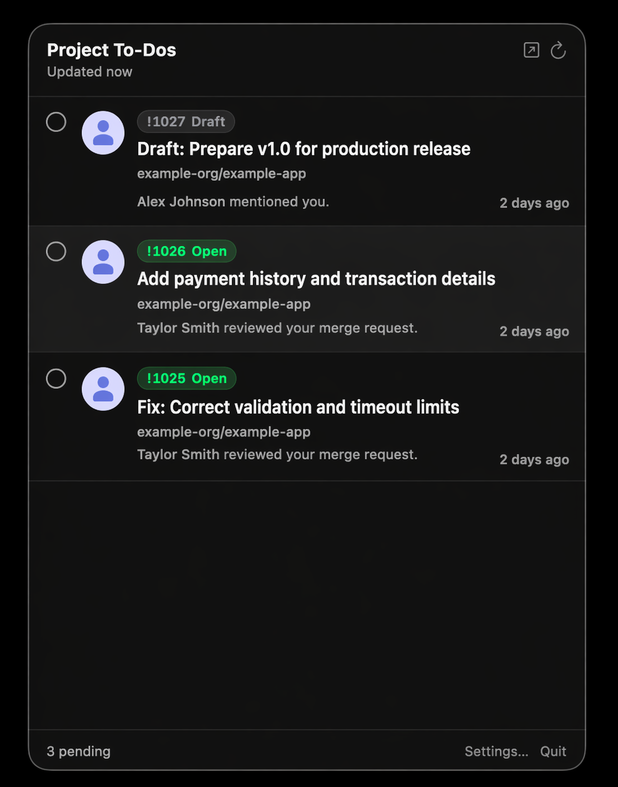

<div align="center">

  # GitLab To-Dos

  A macOS menu-bar app that keeps your GitLab to-do inbox one click away.
  Triage assignments, review requests, mentions and pipeline failures without leaving the keyboard.

  
</div>

## Install

**Homebrew (recommended):**

```sh
brew install --cask vapor-pawelw/tap/gitlab-todos
```

`glab` is pulled in automatically as a dependency. After install, run `glab auth login` once to sign in.

**Manual:** grab the `.dmg` from [Releases](https://github.com/vapor-pawelw/gitlab-todos/releases).

Requires **macOS 14+** and [**glab**](https://gitlab.com/gitlab-org/cli) authenticated with `glab auth login`.

## Menu bar inbox

The menu-bar icon shows a count of pending to-dos and a small red dot whenever unseen to-dos have arrived since you last opened the dropdown. Clicking it opens a rich dropdown that mirrors the GitLab web todo list: avatar, author name, action description, project path, target title, state badge (Draft / Open / Merged / Closed) and relative time. Click a row to open it in your browser, or use the inline checkbox to mark it as done via the GitLab API — rows disappear immediately and are restored if the call fails.

<p align="center">
  
</p>

## Native notifications

Newly detected to-dos become macOS notifications. Delivery is hybrid: up to three new items in a refresh cycle fire individual banners so you can click straight through to the URL; four or more collapse into a single "N new GitLab to-dos" summary so your Notification Center never gets flooded.

## Configurable refresh

The refresh interval is user-controlled from Settings — one minute to one hour. A manual refresh button lives in the dropdown header. Errors (glab missing, auth expired, network down) surface as a non-destructive banner at the top of the dropdown while keeping the last known to-do list clickable.

## First-run onboarding

A guided four-step setup walks new users through everything required: detecting `glab` on `PATH`, verifying `glab auth status`, requesting macOS notification permission and offering launch at login. Each step has a re-check button and falls back to copy-paste install instructions when something is missing.

## Self-hosted friendly

GitLab To-Dos shells out to `glab` with its existing credentials and default host. Self-hosted users get their corporate GitLab URL wired through everywhere — the "Open in browser" link in the header resolves to `https://<your-host>/dashboard/todos`, not `gitlab.com`.

## Building from Source

See [docs/building.md](docs/building.md).

## License

[MIT License](./LICENSE)
